# Currency 1.5 Design

- [Currency 1.5 Design](#currency-15-design)
  - [Introduction](#introduction)
  - [High Level Changes and Architecture](#high-level-changes-and-architecture)
    - [Core Patterns](#core-patterns)
      - [Permission-based Authorization](#permission-based-authorization)
      - [Soft-Forking Contracts](#soft-forking-contracts)
      - [Simple Protocol Processes and removing Downstream Dependencies](#simple-protocol-processes-and-removing-downstream-dependencies)
      - [Timelocks over Monolithic State Machine](#timelocks-over-monolithic-state-machine)
    - [Monetary Governance Process](#monetary-governance-process)
      - [Overview](#overview)
      - [TrustedNodes](#trustednodes)
      - [TrusteeGovernance](#trusteegovernance)
      - [Monetary Policy Functions and their Orchestrators](#monetary-policy-functions-and-their-orchestrators)
      - [Community Governance Process](#community-governance-process)
      - [Community Governance](#community-governance)
      - [Root Policy](#root-policy)
      - [Token Contracts (ECO and ECOx)](#token-contracts-eco-and-ecox)
      - [ECOx Exchange](#ecox-exchange)
      - [ECOx](#ecox)
      - [ECOxStaking](#ecoxstaking)
      - [ECO](#eco)
    - [Open Questions](#open-questions)
    - [Additional Open](#additional-open)
    - [Other Technical Considerations](#other-technical-considerations)

## Introduction

This document contains both a high level architecture and low level specification for the Eco Protocol v1.5 redesign. Throughout the rest of this document, the redesign will be referred to as “Eco 1.5” . This document is intended to serve as ground zero for discussions about the redesign and as a source of truth for the engineering efforts.

Eco 1.5 was inspired by the desire to simplify and modularize the Eco Protocol governance system. The initial implementation of the Eco Protocol is complicated, difficult to upgrade, contains many interdependent components, and an ERC1820 registry system. The goal of this redesign is to accomplish the following:

- Simplify the architecture of the Eco Protocol to invite new contributors
- Maintain full backward compatibility
- Maintain flexibility for upgrades
- Significantly decrease the cognitive overhead for upgrades
- Decrease dynamism and moving parts
- Minimize system interdependency
- Reduce gas costs with only minor changes
- Increase testability of the design so that contracts can be tested as modules
- Ensure that downstream contracts are core dependencies of all other contracts, and not dependent on any other contracts.

## High Level Changes and Architecture

### Core Patterns

#### Permission-based Authorization

In the initial implementation of the Eco Protocol, most contracts communicate and interact through an ERC1820 registry lookup. This means that all contracts must continuously reference the ERC1820 registry, and upgrading the Protocol requires careful consideration and rebinding of dependencies. This is both expensive, and creates a significant amount of cognitive overhead when working on changes to the system.

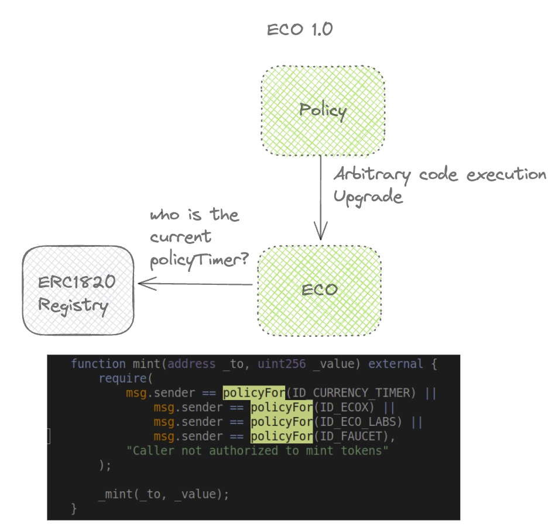

Eco 1.5, where possible, deploys a permissions based architecture, as seen below. Instead of maintaining an ERC1820 registry to validate callers, each contract contains a set of designated roles that are permissioned to call internal functions. For example, below, the core Eco contract below contains roles for “Minting”, “Burning”, “Rebasing” and “Permissions Updating”.

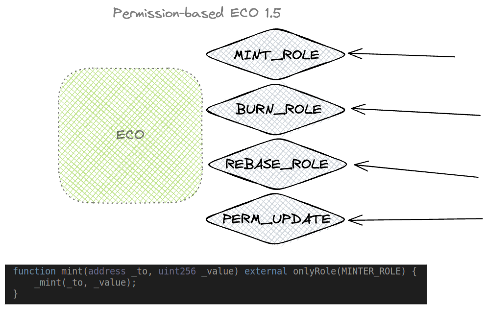

There are a host of advantages to this setup. First of all, it makes individual contracts much more testable and independently verifiable, because interface specifications can be tested without the need for a ERC1820 registry and entire system deployment. It also reduces upgrade complexity by allowing contracts to be replaced by rebinding roles, which will be discussed in the “Soft-Forking Contracts” section. Finally, it should allow for removal of the ERC1820 registry, which will save gas during system calls and reduce system complexity. Most of these permissions can be coded as arrays, which will allow multiple contracts to hold the same role at once.

#### Soft-Forking Contracts

As mentioned before, the permissions based architecture radically simplifies the process of upgrading contracts. Instead of carefully rebinding individual contracts during an upgrade, contracts can be deployed independently, and rebound through calls that change permissions on neighboring contracts. For example, let’s consider the example below to show how the TrustedNodes contract could be changed.

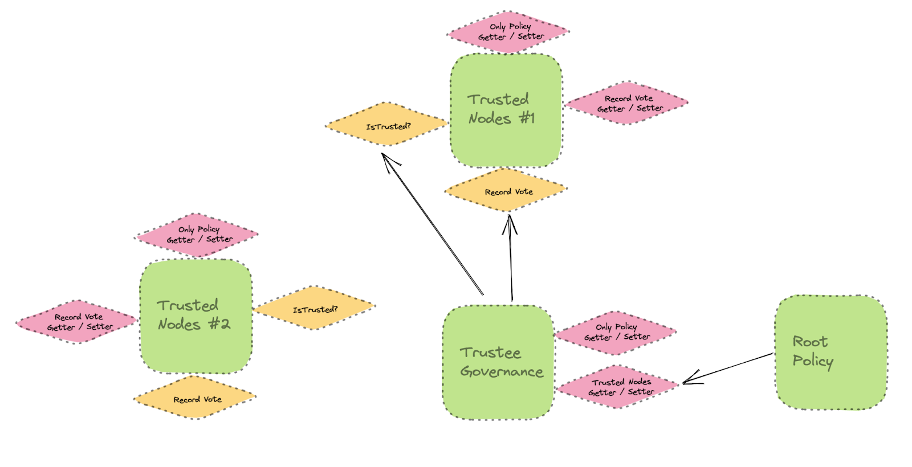

In this example, the Trustee Governance contract that manages the biweekly voting is pointed at the TrustedNodes#1 contract, and the governance system wants to change the TrustedNodes contract. For the sake of this example, let's say there is a new election of Trustees. All the root policy needs to do is call the “Trusted Nodes Setter” function to set the “Trusted Nodes” role in the Trustee Governance contract to the new contract.

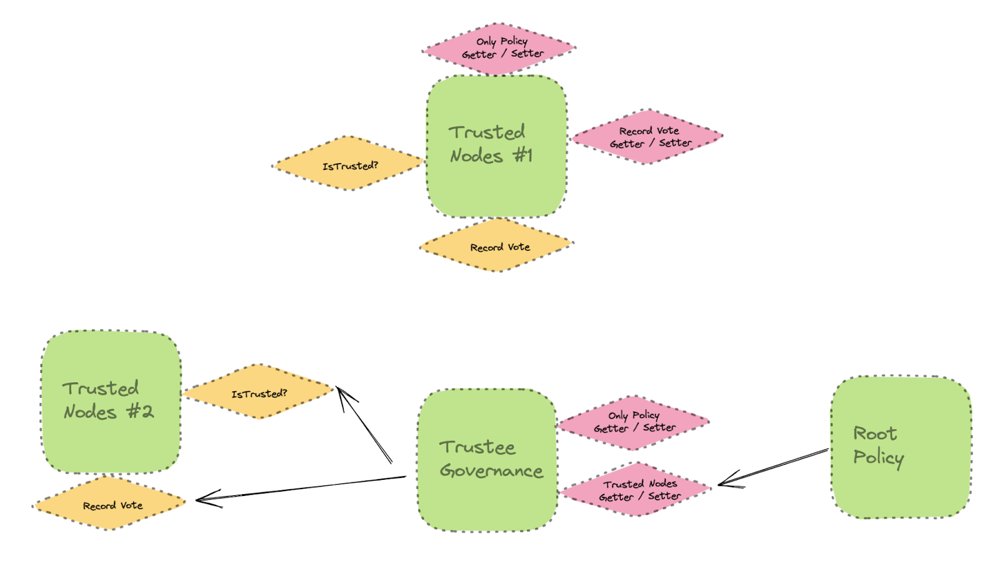

After rebinding the Trustee Governance Contract, the system is good to go. TrustedNodes#1 can continue to exist and previous Trustees can withdraw their ECOx voting rewards, without any need to reference the rest of the system.

This demonstrates how a permissioned based architecture makes it significantly easier to upgrade the Eco Protocol. The rest of this document will reference this pattern, as it is core to the redesign.

#### Simple Protocol Processes and removing Downstream Dependencies

Right now, protocol state transitions come with high global coordination requirements. The monolithic nature of these state transitions means that protocol governance changes are complicated and that protocol state transitions are complex. A key goal of Eco 1.5 is to simplify these state transitions, by ensuring that governance processes follow clear directionality and hierarchy, and that core contracts are not dependent on, or require state knowledge of, peripheral contracts.

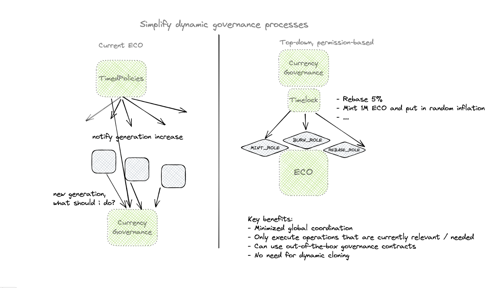

#### Timelocks over Monolithic State Machine

Another key goal of this redesign is to get rid of the monolithic generation timer in the Protocol as it exists today. The single timer makes it extremely difficult to make changes to either the monetary governance, or community governance, in isolation. This design intends to use external or internal timelocks to separate different governance and protocol processes.

### Monetary Governance Process

#### Overview

In this section we will consider the changes for the Monetary Governance process employed by the Trustees to influence Eco stability. Below is a diagram of the current setup of the core contracts that run this process. The numbers indicate how a generation is incremented. Please note that the diagram excludes calls to the ERC1820 contract for legibility.

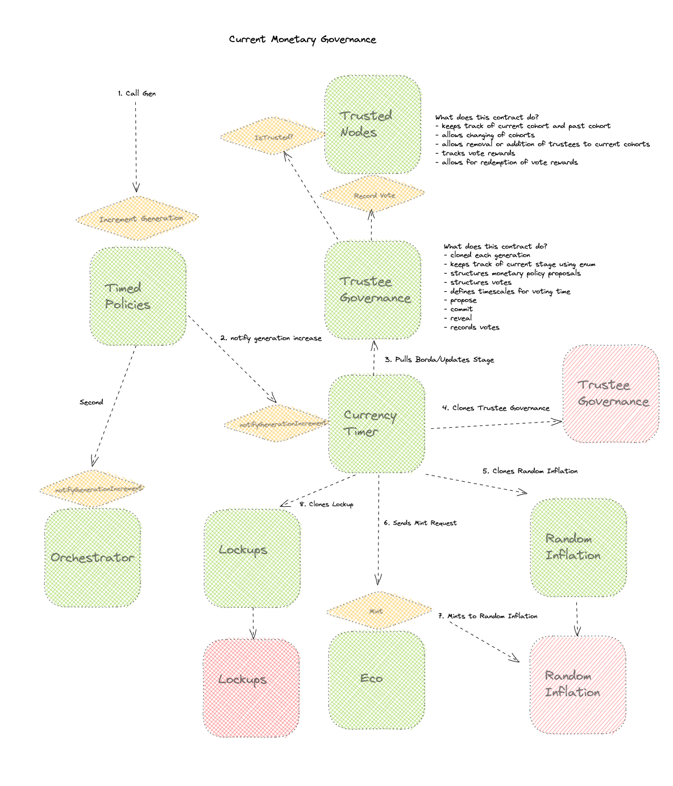

Below is the proposed redesign. The redesign makes the following key changes:

- Replace proxies with system of Getter / Setters
  - As described in the section on permission based authorization, almost all contracts (other than ECO, ECOx and the Root Policy Address) will be de-proxied and converted into the permission based authorization model.
  - All core contracts will have “getter” and “setter” functions. “Getter” functions will allow external contracts and EOAs to read the neighbors of contracts. “Setter” functions will allow an authorized setter (almost always the Root Policy Address), to set the downstream dependencies for various specified function calls.
  - All contracts will have a “Only Policy” and “Only Policy” function, which will specify the designated contract that can change any role in the contract.
- Eliminate Currency Timer → TrusteeGovernance maintains bi-weekly cycle through internal timelocks
  - Instead of maintaining a monolithic generation timer, this architecture proposes the Monetary Governance timer to be managed independently of the Currency Governance timer.
  - This specification proposes that this is done using an internal enumeration in the TrusteeGovernance contract, which cycles through the stages each Monetary Policy cycle. All other contracts will be agnostic to this cycle, and not need to know about the specific timing of the cycle.
  - This also means that the concept of a “generation” for a Monetary Policy cycle will not be unique, but internal to each TrusteeGovernance contract, which will contain its own monotonic counter that will act as a sort of “generation” counter for that contract.
  - Each TrustedNodes Contract holds one cohort
    Instead of requiring the TrustedNodes contract to track multiple cohorts (or elected Trustee groups), the Permission-Based authorization model allows for each cohort to be deployed and elected with a new contract.
  - This will drastically simplify the internal logic of TrustedNodes and will make elections easier for the Protocol to manage.
- Proposals changed from fixed policies to passing in policy function handles.
  - The most significant monetary change in this redesign is the concept of “function handles” being passed into TrusteeGovernance instead of a fixed ballot. This allows Trustees to specific “function calls” that they want to perform, or more generally, specific policy levers they want to call in a designated sequence.
  - This drastically increases the flexibility of the monetary toolkit employed by the Trustees. Trustees could theoretically enact any number of policy levers, or call the same policy lever multiple times in a cycle.
    -This also allows for new monetary policy levers to be added to the governance process trivially. New policy levers could be managed in multiple ways:
    - Downstream policy levers would have to whitelist the TrusteeGovernance contract to call them. The TrusteeGovernance contract could theoretically call any function, and that function would enforce whether the contract was authorized to call it.
    - Alternatively, the TrusteeGovernance contract could contain a whitelist of addresses that would define which downstream contracts were allowed to be called by the TrusteeGovernance contract.
    - Either implementation makes the monetary policy functions toolkit flexible enough to accommodate different governance entities responsible for each function. For example, Trustees could control rebasing and lockups, and a specific fiscal policy group could control random inflation.
- Orchestrators are “per policy”
  - Each policy comes with its own orchestrator. This makes it easy to swap out orchestrators, and to deploy new policy levers without dealing with old ones.
- Pausing only lives on Eco
  - In this architecture, pausing lives in the Eco contracts and upstream contracts are agnostic to whether Eco is paused or not. In this situation, Eco gracefully returns a falsy value to the monetary policy levers if it is paused, and TrusteeGovernance continues as usual.
  - In this sense, “pausing” Eco would only pause the rebase, mint, burn, and transfer (and transferVotingPower) functions in Eco

Below is a diagram of the proposed system at a high level. Note that TrustedNodes, is completely independent of the rest of the system, that TrusteeGovernance only needs to know TrustedNodes address, and that the monetary levers only need to know TrusteeGovernance and Eco (and potentially the Policy Archive). This drastically simplifies the interconnectedness of the monetary system.

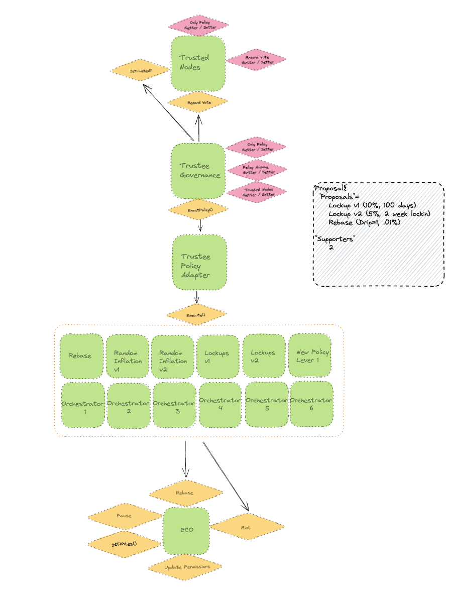

#### TrustedNodes

The responsibility of TrustedNodes in this system is to manage the current cohort of Trustees, to track their votes, and to allocate their rewards. Specifically, the Trusted Nodes contract:

- Keeps track of a given cohort of Trustees
- Sets the Trustee term
- Allows addition or removal of individual Trustees from the cohort
- Allows for claiming of ECOx rewards, and correctly gates them from the voting record.
- Keeps track of each Trustees voting record
- Contains appropriate getter / setters for downstream callers

Below is a diagram of the TrustedNodes contract with its neighbor, TrusteeGovernance. TrustedNodes only needs Getter/Setter functions for the “Only Policy” role, which is authorized to change any other roles, and “Record Vote” role, which is authorized to call the “recordVote” function.

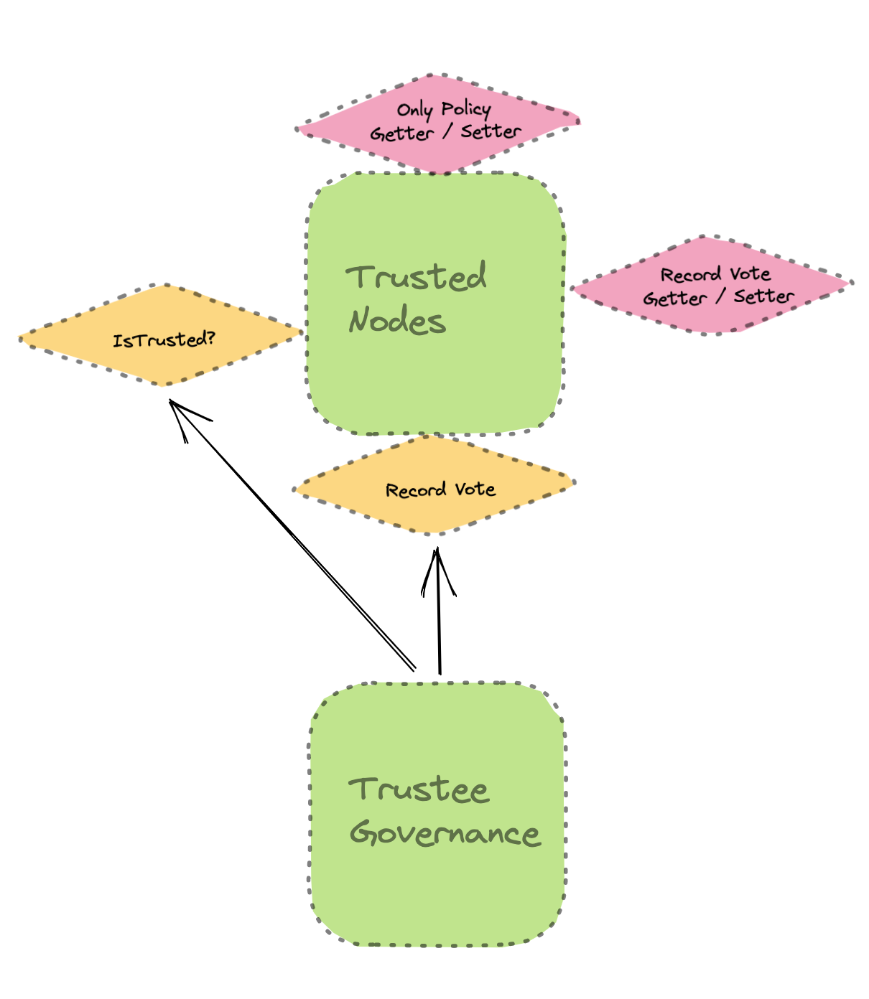

#### TrusteeGovernance

The TrusteeGovernance contract is responsible for tracking the Monetary Governance cycle and facilitating the voting process for Trustees. It is also responsible for calling the downstream monetary policy functions, and recording the result of the cycle in the policy archive. Specifically, the TrusteeGovernance contract:

- Keeps track of the voting stage in an enum
- Contain an internal monotonic counter to track the internal voting cycle number
- Allows Trustees to submit and withdraw proposals. Proposals contain an array of downstream function calls that Trustees vote on.
- Allows Trustees to “support” proposals, per the change to the Borda Process being implemented now.
- Allows Trustees to vote on proposals in a commit stage (like we have now). Commits are hashes, to prevent tactical voting on behalf of the other Trustees. Commits can be overwritten until the reveal phase.
- Allows Trustees to reveal their actual votes, which also cross references the hash of their commits.
- Calculate the winner of the vote, using the modified Borda Count process (that accounts for support transactions).
- Enacts the results of the Trustee voting using a supervisor function. This supervisor function would replace notifyGenerationIncrement.
  - Care should be taken if any downstream function call reverts. It should still increment the counter and reset the voting, in case there is an issue with a downstream lever.

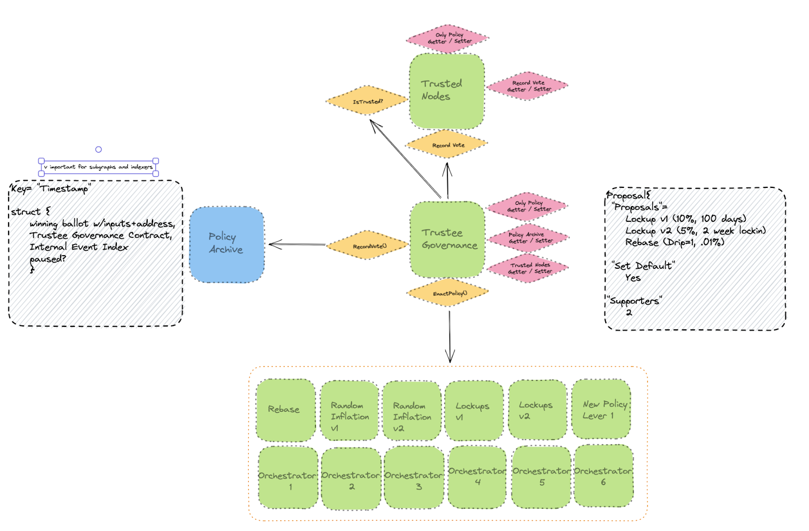

Above is a diagram of the TrusteeGovernance contract with its neighbors, TrustedNodes, PolicyArchive and the Monetary Policy Functions. The TrusteeGovernance contract needs Getter/Setter functions for the “Only Policy” role, which is authorized to change any other roles, the “Policy Archive” role, and the “TrustedNodes” role.

Downstream monetary policy calls can be arbitrary from the perspective of TrusteeGovernance. Individual monetary policy functions will individually enforce if TrusteeGovernance is authorized to call them or not. This means that EnactPolicy() will need to gracefully revert / return false values for calls that fail.

Note that care will need to be taken on how the monetary policies are called sequentially. For example, there may need to be intelligent ordering for Lockups and Rebases at the dApp layer or contract layer. Possibly, the results of the ballot could be fed into a “sequencer” contract that would order the calls to the downstream policies, and could enforce access / external timelocks.

#### Monetary Policy Functions and their Orchestrators

This section covers the general rules / ideas behind how monetary policy functions work. For the purpose of this section, I will explain how they work through the context of a rebase, and mention how things might be different for a random inflation event.

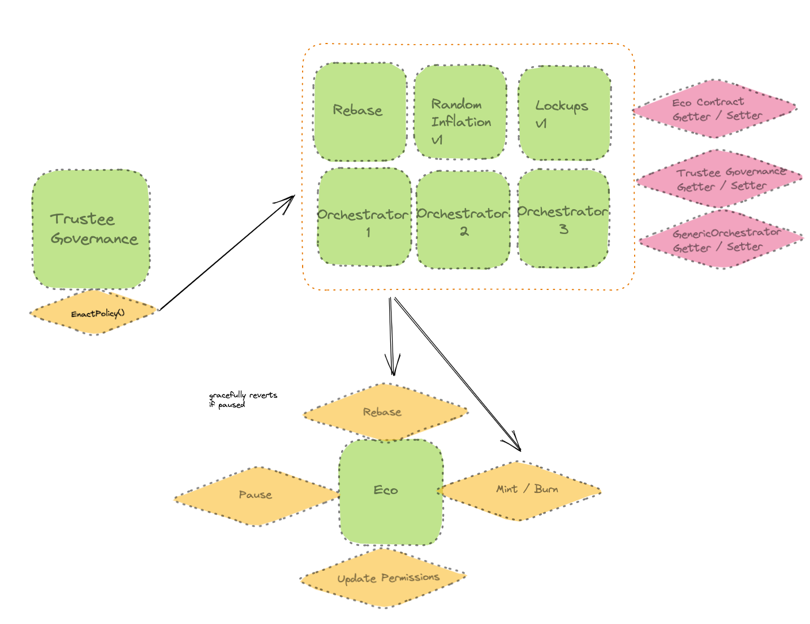

Each monetary policy is responsible for enacting the required changes when called, ensuring the calls are legitimate and from an authorized caller, calling the downstream functions in Eco and other contracts.Each monetary policy may require an orchestrator, or the orchestrator function can live within the lever itself (undefined for the purposes of this specification). Specifically, each monetary policy should:

- Receive calls from the TrusteeGovernance contract
- Validate the calls are legitimate and authorized
- Call the downstream required functions in Eco
- Return false values if downstream functions do not operate because Eco is paused
- Call their respective orchestrators or internal orchestrator functions
- Have appropriate getter/setter functions for the TrusteeGovernance contract and Eco, and the OnlyPolicy functions.
- Clone contracts if required

Each monetary policy lever will need a corresponding role in the Eco Contract to make calls. The rebase lever, for example, would need to call the “rebase” function. Eco would need to authorize this function in order for the call to take effect. The “random inflation” lever would need to call the “mint” function, and would need to be authorized on Eco to do so.

A suggestion for levers like lockups and random inflation that currently clone would be to have all the behavior managed within an indexed array that tracks the various lockups and random inflation within the contracts. This is just an idea and it is left up to the technical implementation of the redesign.

#### Community Governance Process

In this section we will consider the changes for the Community Governance process employed by the token holders to approve changes to the core protocol. Below is the proposed redesign. The redesign makes the following key changes:

- Community Governance
  - Policy Proposals and Policy Votes are replaced into a single contract (EcoGovernance) that manages the stages, proposals, and voting of the community governance contract.
    - This removes the need for cloning and rebinding that happen each generation and during the generation increment. Instead, all the state is managed in the EcoGovernance contract, which contains an enum of the stages possible and rules for changing between stages.
  - Root Policy address executes proposals similar to Compound Bravo
    - Instead of uploading arbitrary bytecode per proposal, which increases the complexity and danger of executing proposals, ECO 1.5 proposes that Eco Upgrade Proposals are submitted like Compound Bravo proposals. Each proposal would contain a couple arrays that would define the specific downstream functions and contracts to call in sequence.
    - The root policy also needs a getter/setter for EcoGovernance to know who the authorized caller is.
  - EcoGovernance timings are flexible
    - Removing the monotonic generation timer means that incrementing the generation doesn’t necessarily need to happen on a specific cadence. The voting cycle can automatically renew each time a proposal passes.
  - Addition of getter/setter functions where necessary
    - As mentioned above and multiple times in this document, permission based authorization functionality will need to be implemented in each relevant contract.
    - Note: the following contracts are proposed to remain proxied:
      - ECO
      - ECOx
      - ECOxStaking
      - Root Policy
    - ECO and ECOx are token addresses, so its obvious why they should remain proxied.
    - The Root Policy and ECOxStaking manage funds, so rebinding them will also require restaking and funds transfers, so it’s best to keep them proxied.


#### Community Governance

The responsibility of EcoGovernance in this system is to manage the proposals going through governance, to track their votes, and to allocate their rewards. Specifically, the EcoGovernance contract:

- Stores the number of total votes for each cycle
- Allows users to register proposals
- Allows users to support proposals and validates the legitimacy of their support.
- Tracks the governance process as it advances through the requisite stages (including time limits)
- Contains supervisor functions to increment the stages at the right time when conditions are met (15% threshold, etc)
- Allows and tracks user votes in favor or against the current proposal.
- Is authorized to call functions on the Root Policy address.
- Calls snapshots on the Eco contract (explained later)
- Has relevant getter/setters to call upstream and downstream functions (Eco, ECOxStaking, and Root Policy)

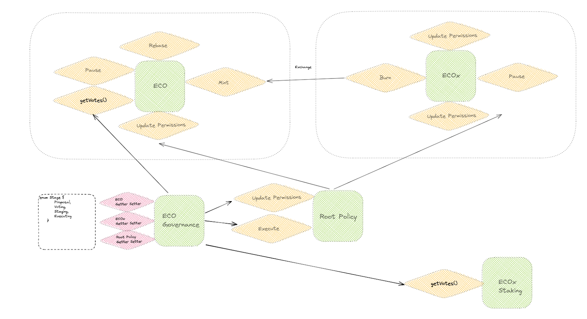

The major changes from the current implementation of Eco are:

- PolicyProposals and PolicyVotes are combined into EcoGovernance which operates on an enum similar to TrustedNodes
- The enum can have variable length timing. For example, it could run for a month until a proposal passes, and then as soon as one does, start a new voting cycle. This will reduce "dead" time at the cost of "predictable" governance timing
- The internal enum removes the need for cloning of contracts each cycle.
  Proposals no longer perform arbitrary code execution, and instead pass vectors with relevant contracts and function calls. This will be explained further in the Root Policy section.
- The addition of appropriate getters/setters.

Another interesting consequence of this architecture is that there could be parallel governance structures that use separate voting schemes and have delegated and restricted powers. For example, in the diagram below, the “Monthly Treasury Distribution” contract could be whitelisted to the “Root Policy” contract, but only be authorized to call transfers from the treasury, once a month, for a maximum of 10,000,000 ECO.

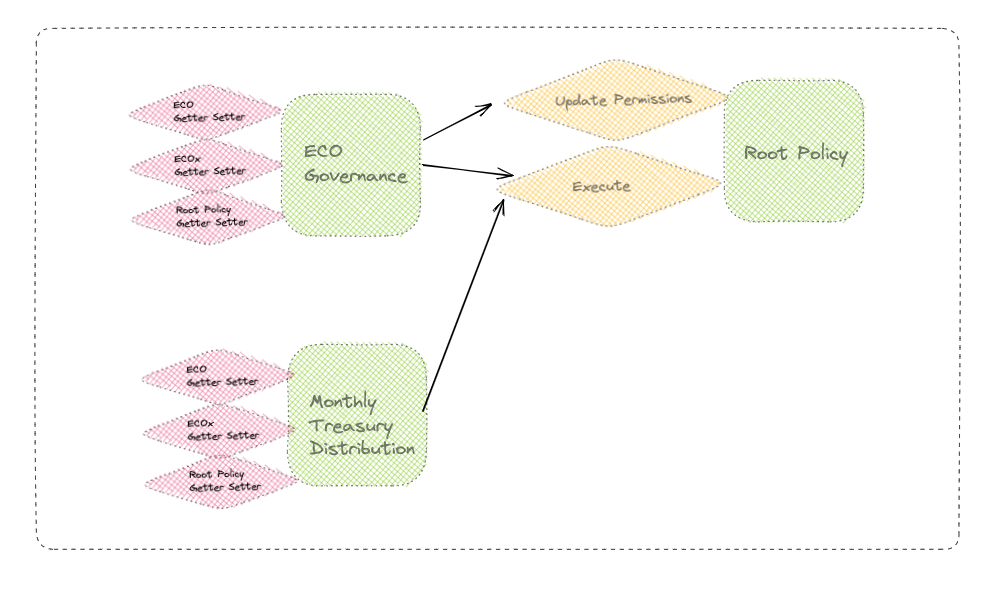

#### Root Policy

The responsibility of the RootPolicy contract in this system is to manage the community treasury, act as the authorized party to rebind all getter/setters, and to execute transactions fed to it from authorized EcoGovernance contracts. The Root Policy will remain proxied. Specifically the root policy:

- Executes commands from community governance contracts
- Manages the community treasury
- Is the main designated getter / setter for most of the contracts in the system

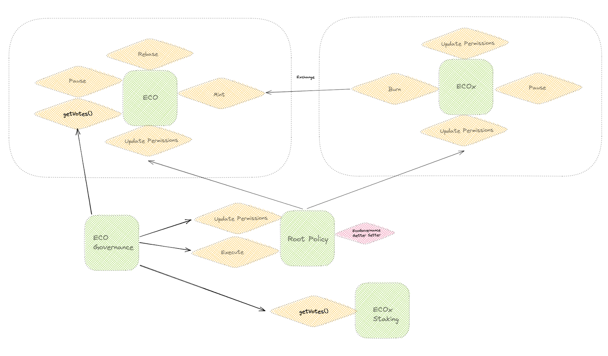

The main changes in this implementation are:

- Compound Bravo-Like Governance

  - Instead of uploading arbitrary bytecode per proposal, which increases the complexity and danger of executing proposals, ECO 1.5 proposes that Eco Upgrade Proposals are submitted like [Compound Bravo](https://docs.compound.finance/v2/governance/) proposals. Each proposal would contain a couple arrays that would define the specific downstream functions and contracts to call in sequence.
  - [Here](https://docs.compound.finance/v2/governance/#propose) is how [Compound Bravo](https://github.com/compound-finance/compound-protocol/tree/master/contracts/Governance) passes in proposal arguments:

  ```solidity
    function propose(address[] memory targets, uint[] memory values, string[] memory signatures,

  - bytes[] memory calldatas, string memory description) returns (uint)
  targets: The ordered list of target addresses for calls to be made during proposal execution. This array must be the same length as all other array parameters in this function.
  - values: The ordered list of values (i.e. msg.value) to be passed to the calls made during proposal execution. This array must be the same length as all other array parameters in this function.
  - signatures: The ordered list of function signatures to be passed during execution. This array must be the same length as all other array parameters in this function.
  - calldatas: The ordered list of data to be passed to each individual function call during proposal execution. This array must be the same length as all other array parameters in this function.
  - description: A human readable description of the proposal and the changes it will enact.
  - RETURN: The ID of the newly created proposal.
  ```

  - So similar to the above, EcoGovernance Proposals would pass in vectors that define downstream contracts, inputs, signatures and calldata.

- Add getter/setter functions for EcoGovernance
  - Root policy only needs one getter/setter role to define who can call functions for it to execute.
  - For now this will contain a single address, but as governance gets more modular, multiple functions could be whitelisted. Which functions they could call would be enforced at the governance contract level.
- Graceful handling of proposal reverts
  - The root policy contract will need to gracefully handle reverts in the instance that a downstream execution fails.

#### Token Contracts (ECO and ECOx)

This section aims to explain the ECO and ECOx implementations in this system, and peripheral contracts. The changes in this section are minimal, other than the change to the way Eco snapshots votes. Below is the proposed redesign. The core changes are:

- Adding appropriate getter / setter functions to ECO and ECOx, with many in ECO to gate monetary policy functions.
- Adding an ECOxExchange function to facilitate the exchange of ECO and ECOx.
- Contracts that remain proxied will still need roles for rebinders
- Ensuring the ECO / ECOx contract returns false for the correct core supply functions when the currency is paused
- Changing the way Eco stores voting balances for EcoGovernance


#### ECOx Exchange

This design proposes a new ECOxStaking contract that manages the conversion of ECOx to ECO. All the contract will do is facilitate the exchange of ECOx to ECO per the formula in the whitepaper. The benefit of having this in a separate contract is that it is easy to change if it ever needs to be changed. The contract needs getter/setters for ECO and ECOx.

#### ECOx

The ECOx contract will operate exactly as it does now. I propose zero changes to the contract, other than the changes required to add relevant permissions and getter/setter functions and to move out the burn function.

#### ECOxStaking

This design proposes that ECOx staking does not change at all, other than to appropriately put in getter/setters,

#### ECO

The major changes to the token contracts are changes to the Eco Contract. The responsibility of the Eco contract is to manage ECO balances, to manage permissions on upstream monetary policy functions, to track voting power, and to snapshot voting power for random inflation and voting. Note that in this implementation, the Eco contract will remain proxied. Specifically, the Eco contract is responsible for:

- Managing Eco balances
- Managing Voting Power balances
- Managing snapshots or checkpoints of voting power to delegates
- Managing delegation
- Managing minting, burning and rebasing, and relevant checkpoints
- Managing the permission based callers of the core currency supply functions (rebase, mint, burn, etc)
- Contain a pause function, and return a falsy value for core supply functions when paused

The major differences in this specification, from the initial implementation, are as follows:

- Replace checkpointing with a gas efficient snapshotting system.
  - This will be explained extensively in the special subsection below. This should shave 50% or more off all transfers after an accounts first transfer.
- The addition of clear permission based authorization and roles for the core currency supply functions (mint, burn, rebase, etc).
  - The upstream monetary policy functions will need to call mint, burn, rebase, and other functions to enact monetary policy. The enforcement of whether these contracts are permissioned will need to live in Eco.
- Modify the core currency supply functions to return false when paused.
  - Monetary policy calls that fail will need to gracefully fail when called, so as not to “freeze” the Trustee Monetary Policy

Replacing Checkpointing with Gas Efficient Snapshotting
This section details the change from checkpointing to snapshotting. For context, Eco currently uses a checkpointing implementation from OpenZeppelin called [ERC20Votes](https://github.com/OpenZeppelin/openzeppelin-contracts/blob/master/contracts/token/ERC20/extensions/ERC20Votes.sol). This is based off of Compounds voting power checkpointing system. This redesign proposes the use of [ERC20Snapshot](https://github.com/OpenZeppelin/openzeppelin-contracts/blob/release-v3.0.0/contracts/token/ERC20/ERC20Snapshot.sol), which is a more gas efficient implementation of the checkpointing system.

Below is a breakdown of a simulated transaction where one user transfers Eco to another user. The redlines in the image delineate the 3 main stages of a transfer: balance transfer, voting power transfer, and checkpointing.

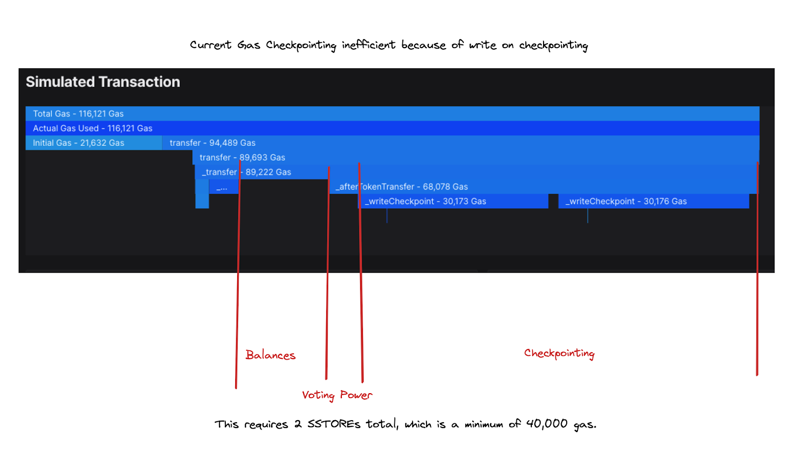

Clearly, the checkpointing stage requires a substantial amount of gas to execute. This is because during a checkpoint, a new uint256 variable is written for both the sender and receiver. This requires 2 SSTORE operations, which are the most expensive operations on Ethereum, clocking in around 20,000 gas each. Finding a way to make this significantly cheaper will save a substantial amount of gas in the redesign.

The reason ERC20Votes checkpoints on each transfer is because of how the Compound Bravo, the main generic Compound governance implementation, works. Each time a proposal is proposed to the Bravo contract, the proposal uses a block number to decide how voting power will be distributed for that proposal. That means _each_ proposal has a different voting power distribution.

Our governance system is not like this. Every 2 weeks, we decide a block number and all proposals for that 2 week period share the voting power distribution. As a result, we don’t really care what happens in between each 2 week voting cycle… We only care about the distribution every two weeks.

TODO Update with information from [Open Zeppelin Governance](https://docs.openzeppelin.com/contracts/5.x/governance) and [Governance API](https://docs.openzeppelin.com/contracts/5.x/api/governance)

The [ERC20Snapshot extension](https://docs.openzeppelin.com/contracts/3.x/api/token/erc20#ERC20Snapshot) is therefore a good fit for our governance system. ERC20Snapshot stores a new balance snapshot each time a “snapshot” event is called in a gas efficient way. As seen below, the snapshot struct is mapped to each account as an array, and the current snapshot is stored as a monotonic counter (see [here](https://github.com/OpenZeppelin/openzeppelin-contracts/blob/release-v3.0.0/contracts/token/ERC20/ERC20Snapshot.sol)).

```solidity
// Snapshotted values have arrays of ids and the value corresponding to that id. These could be an array of a
// Snapshot struct, but that would impede usage of functions that work on an array.
struct Snapshots {
  uint256[] ids;
  uint256[] values;
}
```

When a snapshot is called, the current snapshot counter is incremented by 1.

```solidity
function _snapshot() internal virtual returns (uint256) {
  _currentSnapshotId.increment();

  uint256 currentId = _currentSnapshotId.current();
  emit Snapshot(currentId);
  return currentId;
}
```

In the \_beforeTokenTransfer hook, the logic below is called. This stores the users balance on the first transfer after the snapshot, before the tokens leave the user’s wallet.

```solidity
function _updateSnapshot(
  Snapshots storage snapshots,
  uint256 currentValue
) private {
  uint256 currentId = _currentSnapshotId.current();
  if (_lastSnapshotId(snapshots.ids) < currentId) {
    snapshots.ids.push(currentId);
    snapshots.values.push(currentValue);
  }
}
```

To query a users balance, the code either accesses the snapshot taken, or queries the user’s current “balance of”.

```solidity
/**
 * @dev Retrieves the balance of `account` at the time `snapshotId` was created.
 */
function balanceOfAt(
  address account,
  uint256 snapshotId
) public view returns (uint256) {
  (bool snapshotted, uint256 value) = _valueAt(
    snapshotId,
    _accountBalanceSnapshots[account]
  );

  return snapshotted ? value : balanceOf(account);
}
```

The key intuition here is that if a snapshot is called, and a user has not transferred, the snapshot balance is just that user's balance. If they have transferred, the balance is snapshotted before they transfer.

In action, here are some examples of how it might work.

1. Alice takes a snapshot and increments the counter to 1
2. Bob has 30 Eco and transfers 10 Eco to Alice after a snapshot. The gas efficiency is what we have now.

   

3. Bob transfers to Alice again. In this situation, the snapshot has already been taken, so Bob skips checkpointing / snapshotting and saves close to 50-55k gas.

   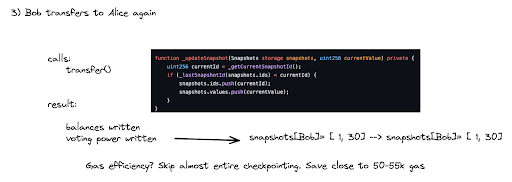

4. Alice queries Bob's voting power. In this situation, the snapshot exists so the snapshot is returned.

   ```solidity
   /**
    * @dev Retrieves the balance of `account` at the time `snapshotId` was created.
    */
   function balanceOfAt(
     address account,
     uint256 snapshotId
   ) public view returns (uint256) {
     (bool snapshotted, uint256 value) = _valueAt(
       snapshotId,
       _accountBalanceSnapshots[account]
     );

     return snapshotted ? value : balanceOf(account);
   }
   ```

5. Alice queries Charlie's voting power. The snapshot does not exist, because Charlie hasn't transferred, so Charlie’s current balance is the snapshot.

   ```solidity
   /**
    * @dev Retrieves the balance of `account` at the time `snapshotId` was created.
    */
   function balanceOfAt(
     address account,
     uint256 snapshotId
   ) public view returns (uint256) {
     (bool snapshotted, uint256 value) = _valueAt(
       snapshotId,
       _accountBalanceSnapshots[account]
     );

     return snapshotted ? value : balanceOf(account);
   }
   ```

6. As a last example, imagine Joe and Mark have the same delegate, and that delegate already transferred in the snapshot.

   _In this situation, the delegate already had a snapshot, so there is no snapshot! Also, they don’t need to save voting power either, because it’s an intradelegate transfer. Therefore, a massive amount of gas is saved, because they are only recording balances._

   This demonstrates that snapshotting is much more efficient already. Note in the scenario above, I assume we pack the snapshot and voting power into a single uint256 like we do for ERC20Votes, and I assume that balanceOf() actually reads an account’s voting power.

   This can be made even more efficient. The examples above store an array that contains data for each snapshot that an account makes a transfer. This means that on the first transfer after each snapshot, costly data will need to be written to the chain.

   As it stands, our governance system only ever needs one snapshot, and we always reference the latest one. In fact, once a given voting cycle has passed, we never need to reference the voting power balances for that cycle ever again. This means we can modify the above implementation to overwrite each person's snapshot everytime a new one is taken. This means each account will only store one uint256, and overwrite it each time a snapshot is taken.

   Revisiting the above, this means that:

   1. Alice takes a snapshot and increments the counter to 2.
   2. Bob has 10 Eco now and transfers 2 Eco to Alice after the snapshot. Instead of pushing a new uint256, we just overwrite the previous one. This means we are saving, at minimum, 30k gas.
      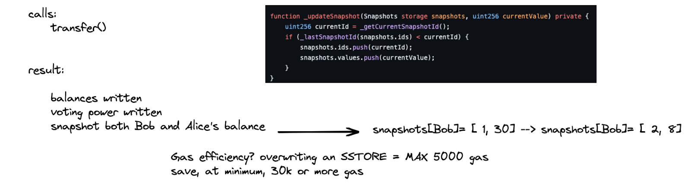

   3. Assume Bob transfers to Alice again. In this situation, the snapshot is written already, so the transfer only changes the balances and vote checkpoints. 50-55k gas saved.
   4. Repeating this example again, imagine Joe and Mark have the same delegate, and that delegate already transferred in the snapshot.
      1. In this situation, the delegate already had a snapshot, so there is no snapshot! Also, they don’t need to save voting power either, because it’s an intradelegate transfer. Therefore, a massive amount of gas is saved, because they are only recording balances.

This technique means that the snapshot will only be ever freshly written one time. The high gas operation will only occur on a user’s first transfer. Visually in the simulated transfer below, that saves a massive amount of gas.

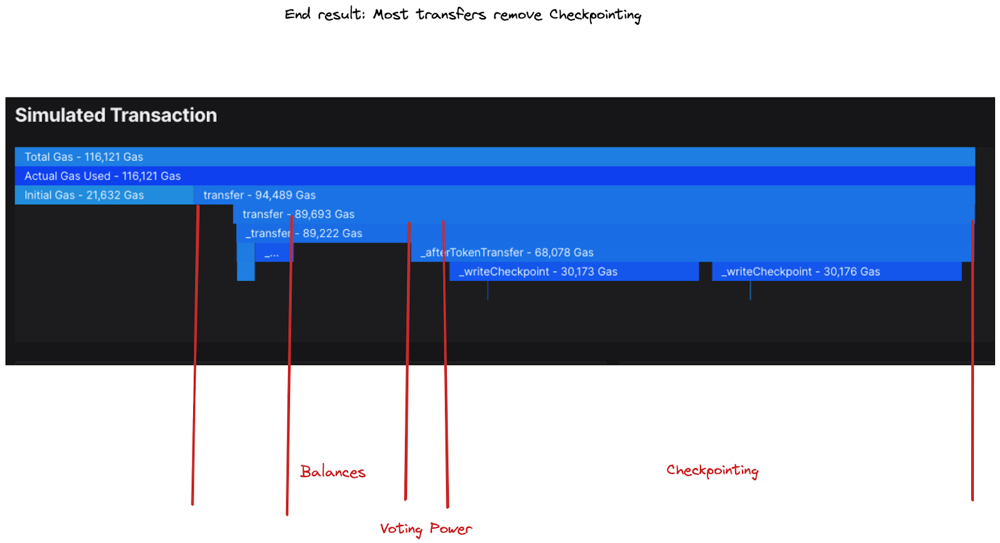

Making this system flash loan proof can be done in 2 ways.

1. Flash Loans happen in atomic transactions and therefore have to be performed by contracts. A suggestion from the [OpenZeppelin Forum](https://forum.openzeppelin.com/t/erc20snapshot-and-flash-loans-swaps-mints/3094/8):

   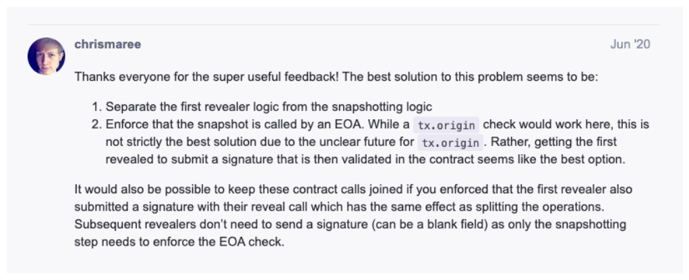

   This requires an EOA signature to call the function, and therefore prevents flashloans because only contracts can do flash transactions. This means the attacker could still MEV sandwich a snapshot increment in a block, but they couldn’t do it through a flash loan.

2. CurrencyGovernance writes a block to the snapshot contract and \_currentsnapshotID is packed with that blocknumber.

   1. In_BeforeTokenTransfer() a if statement checks if the current block requires a new snapshot.
   2. If so, the user calls the snapshot on the first transfer of that block, before token balances change.

   In this situation, the solution is flash loan resistant, the protocol gets 1 block of safety, and the \_beforeTokenTransfer check is only 2 additional gas for the block number load.

   The efficient implementation of this system does have one issue at the moment, which is Random Inflaiton. 1 potential issue while we still have random inflation. If there is an ongoing Merkle challenge and the single snapshot changes, the proposer can get rugged. There are two simple mitigation strategies for this

   1. Proposers can't propose random inflation if a snapshot is occurring soon (would require linkage between EcoGovernance and Inflation contract, which is unideal)
   2. Inform proposers they will get rugged, and adjust the supervisor to not challenge if snapshot is coming up (prefer this)

   **Further Improving this in Eco 2.0**

   I don’t want to add this to 1.5, but this idea could work in 2.0. Right now, the standard ERC20Votes implementation does not track voting power if you don’t delegate. This means to vote, you have to delegate to yourself.

   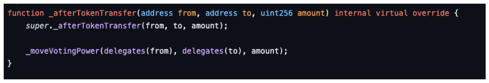

   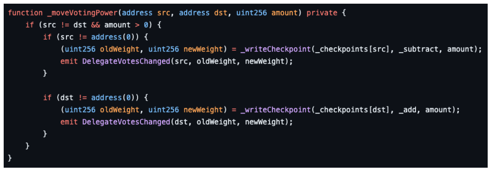

   We could implement this same feature into the system above. In addition, we would give all “untracked voting power” to “tracked voting power” members. You are essentially choosing to have more expensive transfers, but you are rewarded with the voting power of accounts who don’t want their voting power. The benefits of this potential approach are:

   - No delegate means transfers are cheaper but you have no voice.
   - Distribute voting power from voters who don't care --> voters who care
   - Contracts by default have no delegate, therefore contract interactions are cheaper. Contracts don’t become “sinks” for voting power, and the protocol can’t get “stuck” easily.
   - Below the 3 main stages are shown in this system. In most cases, a user is paying significantly less than the initial Eco implementation, and they are given the ability to choose cheaper transfers or more voice.

   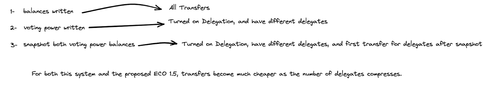

### Open Questions

1. Should we allow the TrusteeGovernance contract to call whatever it wants or should we specify the ballot?
   1. There is a compromise where we whitelist functions and we use if / match statements to call functions in a loop.
2. Should we consider dropping the support threshold each generation if a proposal doesn’t pass muster?
3. Where else can we compact values using uint256 compaction?
4. Should we have variable length timing in EcoGovernance?
5. Do we need Getter / Setters for proxied contracts?

### Additional Open

1. Default proposal option for proposals?
2. Should Trustees overwrite their proposals / commits / votes each stage to save gas?
3. Should we change or optimize the policy levers with this change or no? Some potential optimizations: Random inflation (1 claim), Rebasing drip, Lockups with a longer entry period, etc.
4. Where should orchestrators live?
5. How should we deal with upgrades that need to be correctly timed?
6. Should we have all the logic for lockups and random inflation contained within the core contract instead of cloned?
7. Should we add the “no delegate, no voting power” change in Eco 1.5?
8. Should we have a second contract manage voting power for Eco?
9. How do we feel about the tradeoff between a fully upgradeable, but unsafe, comm governance concept we have today, vs the safer but less robust compound bravo style?
   1. decentralization/upgradeability, futureproofing
   2. Likelihood of mistakes / necessity of these kinds of breaking changes

Future:

- TrustedNodes term management??
- How are timelocks done in other big projects?
- Refund management changes / proposal rollover… refund proportional to proposal threshold. Retry times?

Other:

- Refunding people who submit proposals… don’t want insane threshold. The refund makes it less spamable, how do we keep it without being exclusive.
- Different support thresholds for various proposals.
- How to upgrade the system completely??

### Other Technical Considerations

Upgrade Considerations

TBD
